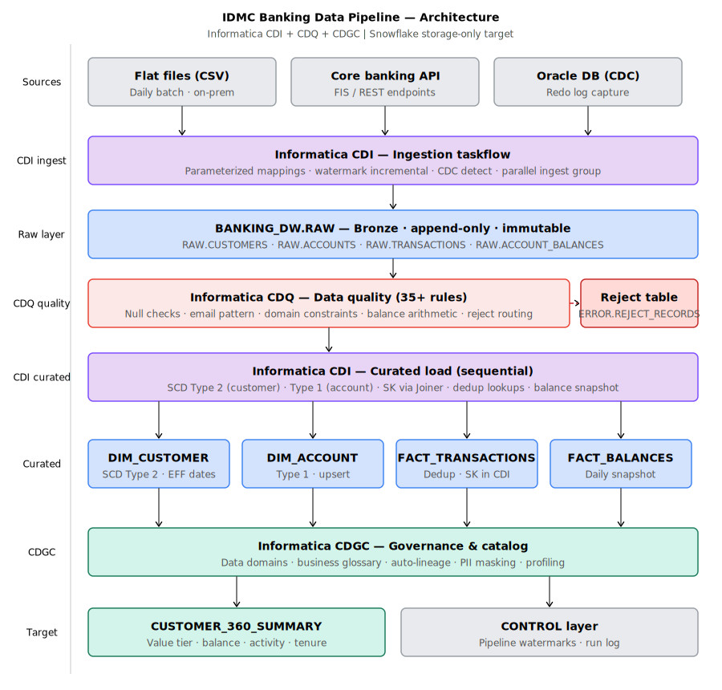

# IDMC Banking Data Pipeline


A banking data pipeline built on **Informatica IDMC** (CDI + CDQ + CDGC) with Snowflake as the storage-only target. Covers CDC detection, SCD Type 2, data quality enforcement and dimensional loading for a regional bank deposit data platform.

---

## Architecture



> **Key principle:** Snowflake is storage-only. Every transformation, quality rule and governance policy runs in Informatica IDMC — not in Snowflake SQL, not in dbt.

---

## What this covers

| Capability | Implementation |
|---|---|
| CDC detection (file-based) | `cdc_operation` column + MD5 hash comparison — detects inserts vs genuine updates |
| SCD Type 2 | `DIM_CUSTOMER` — effective dating, record hash, expire-and-insert driven by CDI |
| CDQ data quality | 8 rules on customer entity — null checks, email pattern, KYC domain, segment domain |
| Reject routing | All failed records go to `ERROR.REJECT_RECORDS` with structured reason codes |
| IDMC-native design | No transforms in Snowflake SQL — CDI owns all logic, CDQ owns all quality |
| Banking domain model | Customer → Account (deposits) → Transaction chain with star schema target |
| Parameterized taskflows | Runtime parameter sets — zero code change between DEV / UAT / PROD daily runs |

---

## Data model

### Source entities

| Entity | Source Type | Load Pattern | CDC? |
|---|---|---|---|
| Customers | CSV flat file | Delta (CDC) | Yes — `cdc_operation` field |
| Accounts | CSV flat file | Full load daily | No |
| Transactions | CSV flat file | Incremental (by date) | No |

### Snowflake target (star schema — CURATED layer)

```
                DIM_DATE
                   │
DIM_CUSTOMER ──────┼─── FACT_TRANSACTIONS
(SCD Type 2)       │
                   │
            DIM_ACCOUNT (Type 1)

ERROR.REJECT_RECORDS  ← CDQ reject sink
```

### Snowflake schemas

| Schema | Purpose | Mutability |
|---|---|---|
| `BANKING_DW.RAW` | As-landed records — audit log of every ingest | Append-only (immutable) |
| `BANKING_DW.CURATED` | Star schema — dims and facts | Upsert / SCD2 / append |
| `BANKING_DW.ERROR` | CDQ reject records with structured reason codes | Append-only |

---

## Key design decisions

### 1. Why Snowflake is storage-only

All transformation logic lives in Informatica CDI — not in Snowflake SQL, dynamic tables, or dbt:

- **Lineage:** CDGC auto-captures lineage from CDI mappings. Snowflake SQL transforms are invisible to Informatica lineage graphs.
- **Governance:** CDQ rules are centrally managed in IDMC. SQL CASE/WHEN scattered across views is ungovernable.
- **Auditability:** One system owns transformation provenance — critical for BSA/AML and SOX audit response.
- **Non-technical access:** Compliance and risk teams can see and validate rules in CDGC without SQL knowledge.

### 2. SCD Type 2 on DIM_CUSTOMER only

SCD2 is applied selectively — only where regulatory history is material:

- **Customer:** KYC status, segment and address changes are tracked. Knowing a customer was `RETAIL` when a transaction occurred, later upgraded to `PRIVATE`, is relevant for AML risk scoring.
- **Accounts:** Status changes (ACTIVE→SUSPENDED) use Type 1 overwrite. The RAW layer retains the full audit trail if needed for litigation holds.

### 3. CDC without database redo logs

CDC is file-based (simulating a core banking batch extract), using:
1. Source system stamps `cdc_operation` (INSERT/UPDATE/DELETE)
2. CDI **Router transformation** separates new vs changed records
3. **Expression transformation** computes MD5 hash of tracked fields
4. **Lookup** on DIM_CUSTOMER compares incoming hash to stored hash
5. Hash mismatch → SCD2 expire-and-insert; hash match → skip

### 4. Parameterization strategy

Every file path, date, connection name and run identifier is a `$$VARIABLE`. The taskflow runs in DEV, UAT and PROD with different parameter sets — zero code change. Historical reprocessing requires only changing `$$LOAD_DATE` in the parameter file.

---

## CDQ reject scenarios in sample data

The datasets include deliberate bad records to test CDQ rule enforcement end-to-end:

| Record | Dataset | CDQ Rule | Expected Outcome |
|---|---|---|---|
| `C012 george.patel@invalidomain` | customers_cdc_delta | CQ-002 INVALID_EMAIL_FORMAT | Reject → ERROR table |
| `TXN-20240319-0012` amount=`-50.00` | transactions | FIL_VALID pre-gate | Reject → ERROR table |
| `A10013 C009` status=`SUSPENDED` | accounts | — | Valid record — SUSPENDED is a valid domain value |
| `TXN-20240319-0011` status=`DECLINED` | transactions | — | Valid record — declined transactions are real banking events |

The last two test that CDQ doesn't over-reject — distinguishing genuinely invalid data from valid-but-unusual banking scenarios is a core quality design skill.

---

## Running locally

### Prerequisites
- Python 3.11+ (for dataset inspection only)
- Snowflake account (for DDL execution)
- Informatica IDMC trial account (for mapping and taskflow implementation)

### Set up Snowflake
```sql
-- Run in Snowflake worksheet (requires SYSADMIN role)
\i ddl/snowflake_ddl.sql
```

### Datasets
Sample files are in `datasets/` — 10 customers, 15 accounts, 15 transactions with intentional bad records for CDQ testing.

---

## Domain context

This pipeline covers a regional US bank operating deposit products:

- **CHECKING** — daily transaction accounts, overdraft facility
- **SAVINGS** — interest-bearing, limited withdrawal
- **MONEY_MARKET** — higher-yield, higher minimum balance

Key regulatory drivers reflected in the design:
- **BSA/AML** — KYC status tracking (SCD2), transaction monitoring
- **GLBA** — PII protection via CDGC domain classification and masking policies
- **SOX** — audit trail via immutable RAW layer
- **PCI-DSS** — wire transfer reference handling

---

## Project structure

```
datasets/          Source CSV files (customers, accounts, transactions)
ddl/               Snowflake DDL — RAW, CURATED and ERROR schemas
mapping-specs/     Informatica CDI mapping designs (3 mappings)
taskflow/          CDI taskflow orchestration design
quality-rules/     Informatica CDQ rule set (customer entity)
docs/              Architecture diagram and governance spec
```
